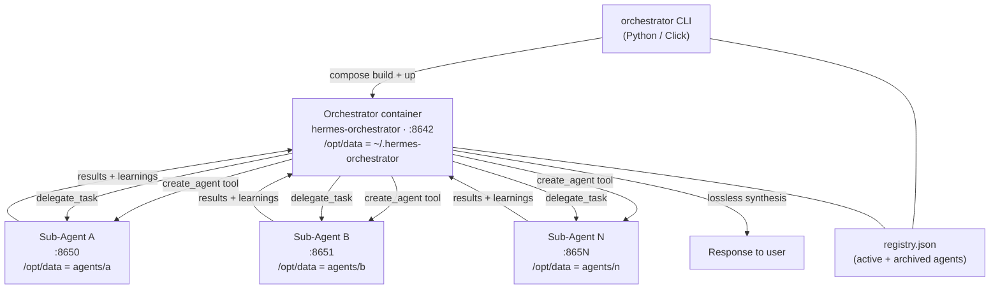

# Architecture

## System diagram



## Key principles

- **One orchestrator, many sub-agents.** The orchestrator is the single external-facing entity. It routes every request to the right specialist(s) and synthesises their responses — it never answers directly.
- **Goals are persistent.** Goals set via `orchestrator agent goal set` are written into the sub-agent's `memories/MEMORY.md`. Hermes injects this file into every session's system prompt, so the goal is active from the agent's next conversation onward with no restart needed.
- **Profiles are volumes.** Each sub-agent's Hermes profile lives at `agents/<name>/` on the host, mounted into their container as `/opt/data`. Skills, tools, memory, and session state all persist there.
- **The orchestrator extends sub-agents.** Because the orchestrator has `agents/` mounted at `/workspace/agents/`, it can write new tools and skills directly into any sub-agent's profile. The built-in `create-sub-agent-tool` and `create-sub-agent-skill` skills guide this.
- **Self-learning loop.** Sub-agents accumulate memories and learned skills inside their profile volumes. The orchestrator reads summaries back and refines its routing over time.

---

## Repository layout

```
/
├── orchestrator/               # Python package — install with: uv pip install -e .
│   ├── __init__.py
│   ├── agent.py                # Agent pydantic model
│   ├── cli.py                  # Click CLI (entry point: `orchestrator`)
│   ├── config.py               # Config model + loader (hermes-team.yaml)
│   ├── docker.py               # DockerClient wrapper
│   ├── manager.py              # AgentManager — all business logic
│   └── registry.py             # AgentRegistry — reads/writes registry.json
│
├── tools/                      # Python tools baked into the ORCHESTRATOR container
│   ├── create_agent.py         # Tool: spin up a sub-agent + register it
│   └── product_research_pipeline.py
│
├── skills/                     # Hermes skills baked into the ORCHESTRATOR container
│   ├── create-sub-agent-tool/
│   │   └── SKILL.md            # Skill: write a new Python tool into a sub-agent's profile
│   └── create-sub-agent-skill/
│       └── SKILL.md            # Skill: write a new SKILL.md into a sub-agent's profile
│
├── tests/
│   ├── conftest.py
│   ├── test_cli.py
│   ├── test_manager.py
│   └── test_registry.py
│
├── Dockerfile                  # Builds orchestrator image (bakes tools/ and skills/ in)
├── entrypoint.sh               # Syncs tools/ and skills/ into /opt/data on every start
├── docker-compose.yml          # Starts the orchestrator container
├── pyproject.toml              # Package definition + dev deps
├── hermes-team.yaml            # Optional config overrides (image, ports, etc.)
└── registry.json               # Runtime — agent registry (git-ignored)
```

---

## Runtime state (`registry.json`)

The registry is a JSON file written by `AgentManager` on every mutation. It is the authoritative source of truth for which agents exist and on which ports.

```json
{
  "active": {
    "trend-analyst": {
      "name": "trend-analyst",
      "summary": "Identifies macro trends from economic and social data",
      "port": 8650,
      "profile_dir": "agents/trend-analyst",
      "created_at": "2025-05-02T...",
      "status": "running",
      "goals": ["Monitor CPI releases weekly", "Track consumer sentiment index"]
    }
  },
  "archived": {
    "old-agent": { "...": "..." }
  }
}
```

---

## Goals flow

Goals are the mechanism for giving a sub-agent a standing objective that persists across every conversation.

```
orchestrator agent goal set trend-analyst "Monitor CPI releases weekly"
        │
        ▼
agents/trend-analyst/memories/MEMORY.md
  ## Orchestrator Goals
  - Monitor CPI releases weekly

        │  (hermes injects MEMORY.md into every session system prompt)
        ▼
trend-analyst hermes session
  [system]: ... ## Orchestrator Goals\n- Monitor CPI releases weekly ...
```

This mirrors hermes' own `/goal` mechanism but works at the profile level, so it survives gateway restarts and new sessions.

---

## How tools and skills reach the orchestrator

On every container start, `entrypoint.sh` runs before hermes and copies:

```
/opt/hermes-builtin/tools/  →  /opt/data/tools/    (cp -n, no-overwrite)
/opt/hermes-builtin/skills/ →  /opt/data/skills/
```

`/opt/hermes-builtin/` is baked in at build time from the project's `tools/` and `skills/` directories. The no-overwrite flag preserves any local customisations to the profile.

**To add a new orchestrator capability**, add a file and rebuild:
```bash
# New programmatic capability (Python / subprocess / API)
touch tools/my_tool.py
docker compose build && docker compose up -d

# New instructional workflow (shell + existing hermes tools)
mkdir skills/my-skill && touch skills/my-skill/SKILL.md
docker compose build && docker compose up -d
```

---

## How the orchestrator extends sub-agents

The orchestrator container mounts `/workspace` (this project directory). It can write directly into any sub-agent's profile:

| Write to | Effect |
|---|---|
| `agents/<name>/tools/<tool>.py` | New Python tool for that sub-agent |
| `agents/<name>/skills/<skill>/SKILL.md` | New skill for that sub-agent |
| `agents/<name>/memories/MEMORY.md` | Persistent memory / goals |

The built-in orchestrator skills handle the first two:
- **`create-sub-agent-tool`** — guides writing a properly formatted tool file
- **`create-sub-agent-skill`** — guides writing a properly formatted SKILL.md

After writing tools or skills, restart the target container: `docker restart <agent-name>`.  
Goals written to `MEMORY.md` take effect immediately on the next session — no restart needed.

---

## CLI reference

```
orchestrator start                       Build image, start orchestrator, run Hermes setup on first launch
orchestrator chat                        Open orchestrator Hermes UI at http://localhost:8642

orchestrator agent add <name>            Spin up sub-agent, register in registry.json, prompt for Hermes setup
orchestrator agent remove <name>         Stop container, archive profile to agents/.archive/<name>
orchestrator agent recover <name>        Restore archived agent, restart container on next available port
orchestrator agent list                  Table of all active agents with port, summary, goal count

orchestrator agent goal set <name> <g>   Add a persistent goal (written to agents/<name>/memories/MEMORY.md)
orchestrator agent goal list <name>      Show current goals for an agent
orchestrator agent goal clear <name>     Remove all goals for an agent
```

---

## Configuration (`hermes-team.yaml`)

Drop a `hermes-team.yaml` in the project root to override defaults:

```yaml
image: nousresearch/hermes-agent:latest
orchestrator_name: hermes-orchestrator
orchestrator_port: 8642
agent_base_port: 8650
```
